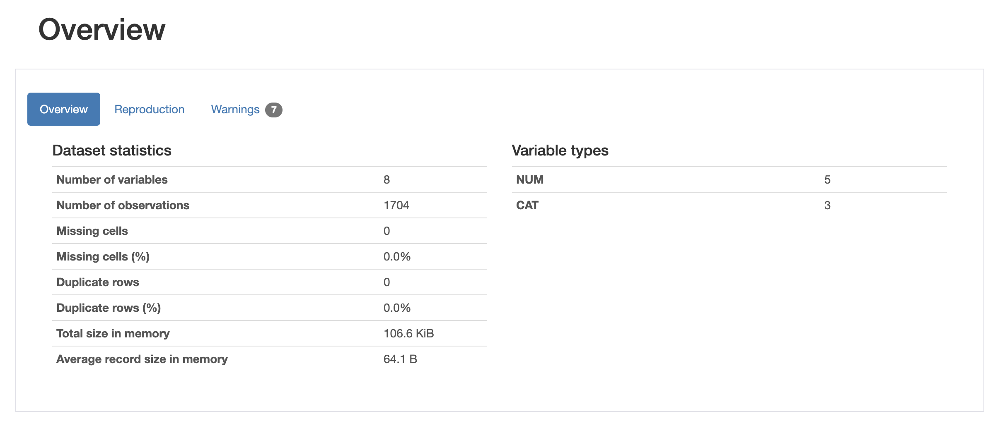
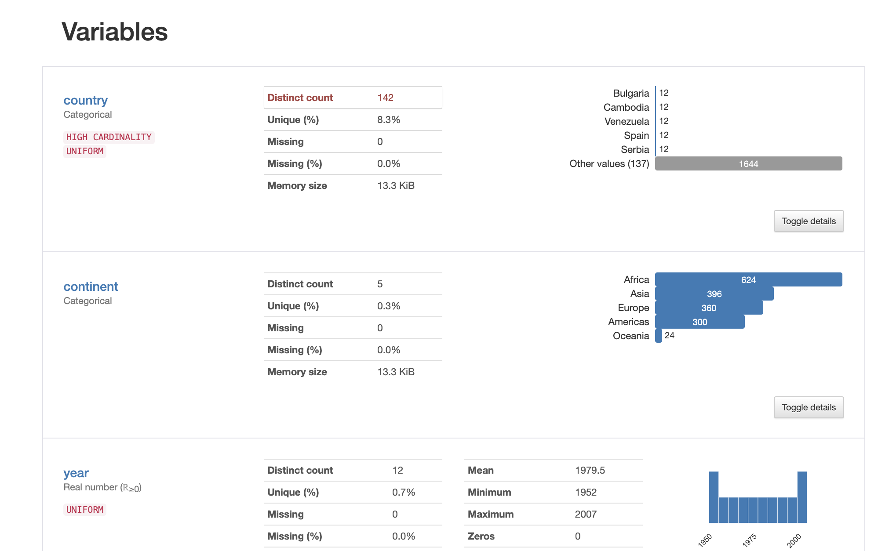
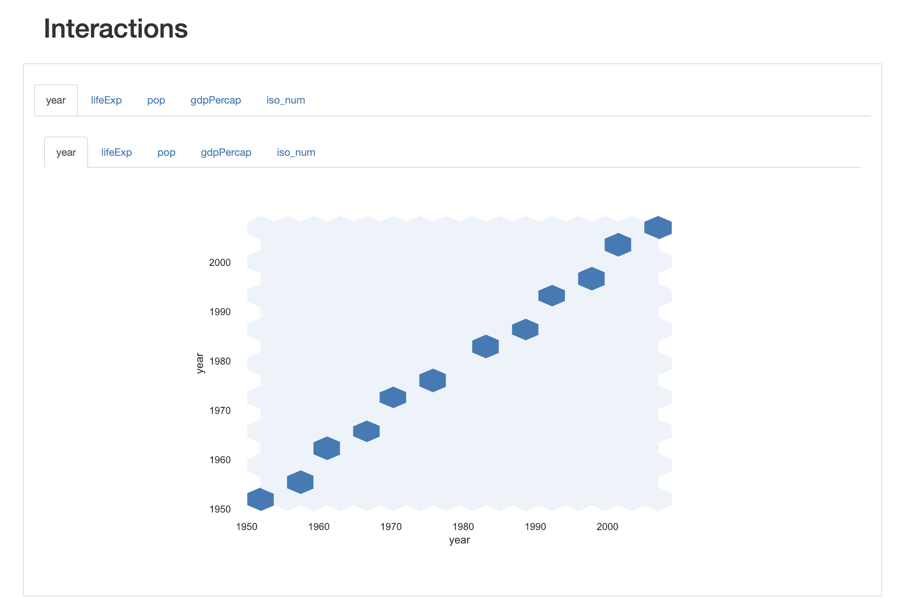
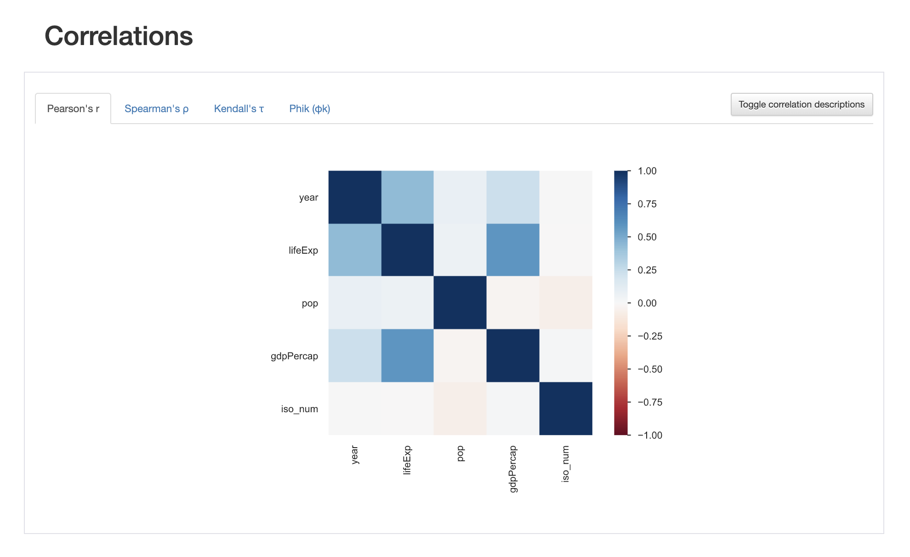
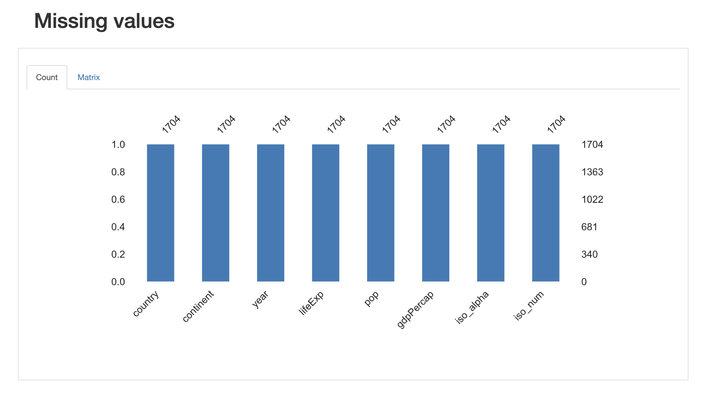
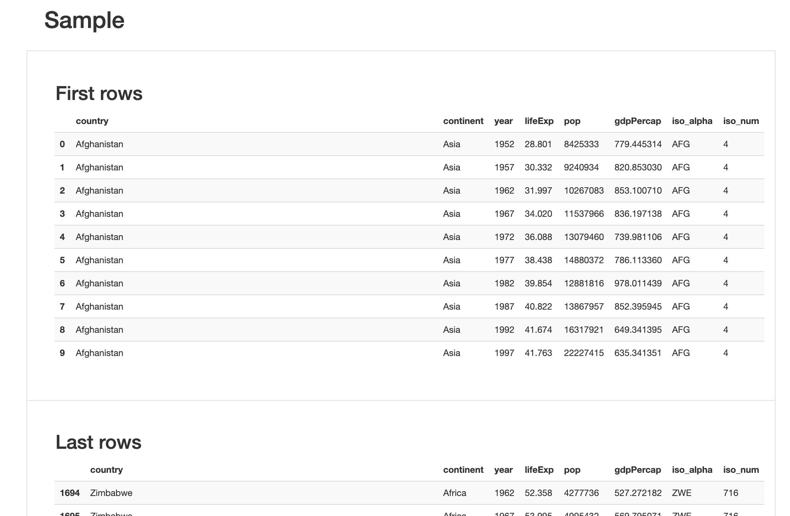

## Pythonでできること  
## 【爆速ガイド付き】
Webをしていたピカピカ一年生の  
データエンジニアのPythonまとめ  
-まれにソースを添えて-

---

### お前、誰よ
<hr>
#### やっしー
- メンバーズデータアドベンチャー
- データアーキテクト・アナリスト
- Twitter @yasshi_dayooon

<hr>
Portfolio<br>


---
### 注意
- Pythonの環境構築方法については、Anaconda,pyenv,パッケージ版,Colab等色々ありますが、戦争になるので、カバーしません

---

### Pythonでできること
<hr>
- **Web**、スマホ開発
- **データ分析、機械学習**
- **数値計算**
- クラウド
- API

---?image=https://images.sftcdn.net/images/t_app-cover-l,f_auto/p/1790a008-96d6-11e6-8047-00163ed833e7/669733406/python-screenshot.png&position=right&size=20% 40%

### [Python](https://www.python.org/)とは
<hr>
みんな大好き   
- Simple is better than complex
- Complex is better than complicated
- Flat is better than nested

[The Zen of Python](https://www.pythonic-exam.com/pythonic)より一部抜粋

---

### これから各工程に共通する作業

```bash
python -m venv [仮想環境名]
cd [仮想環境名]
source bin/activate
pip install --upgrade pip
```
@snap[south span-150]
@[1](Pythonの仮想環境を構築)
@[2](できたフォルダ内に移動)
@[3](仮想環境のアクティベート)
@[4](pipのアップグレード)
@snapend

---

### Web,スマホ開発
- **[Django](https://www.djangoproject.com/)**(多機能・安全性)
- **[Flask](https://a2c.bitbucket.io/flask/)**(シンプル・拡張性・機械学習API)
- [Flutter](https://flutter.dev/)(マルチプラットフォーム)

+++

@snap[west span-45]
## [Django](https://www.djangoproject.com/)
@snapend

@snap[east span-60]
```bash
pip install django
django-admin startproject [PROJECT_NAME] .
python manage.py migrate
python manage.py runserver
```
@snapend

@snap[south span-100]
@[1](Djangoのインストール)
@[2](Djangoプロジェクトを作成)
@[3](データベースのマイグレーション)
@[4](サーバー起動)
@snapend

+++

@snap[west span-45]
## [Flask](https://a2c.bitbucket.io/flask/)
@snapend

@snap[east span-60]
```python
"""
コマンドにてFlaskのインストール▼
pip install Flask
"""
# app.py作成▼
from flask import Flask
app = Flask(__name__)

@app.route('/')
def hello():
    name = "Hello World"
    return name

if __name__ == "__main__":
    app.run(debug=True)
    
# サーバー起動▼
python app.py
```

@snap[south span-100]
@[1-4](Flaskのインストール)
@[6,7](インポートとアプリの初期化)
@[10-12](ルートアクセス時の処理記述)
@[13,14](main文にサーバー起動を書く)
@[16,17](サーバー起動)
@snapend

+++

---

### データ分析、機械学習
- [pandas](https://pandas.pydata.org/)(データ整備、鳥瞰)
- [scikit-learn](https://scikit-learn.org/stable/)(モデリング・回帰,分類)
- [Tensorflow](https://www.tensorflow.org/),[Keras](https://keras.io/ja/),[PyTorch](https://pytorch.org/)(ディープラーニング)
- [Matplotlib](https://matplotlib.org/),[Plotly](https://plotly.com/python/),[Dash](https://dash.plotly.com/),[Streamlit](https://www.streamlit.io/),[pyDeck](https://deckgl.readthedocs.io/en/stable/)(可視化)

+++

### Tips

+++

#### [pandas-profiling](https://github.com/pandas-profiling/pandas-profiling)

```python
"""
以下コマンドにてライブラリのインストール▼
pip install plotly
pip install pandas
pip install pandas-profiling
"""

import pandas as pd
import pandas_profiling as pdp
import plotly.express as px

gapminder_df = px.data.gapminder()
pdp.ProfileReport(gapminder_df).to_file("output.html")
```

@snap[south span-100]
@[1-6](ライブラリのインストール)
@[8-10](ライブラリのインポート)
@[12](gapminderデータセットの読み込み)
@[13](pandas-profilingでHTML出力)
@snapend

+++



+++



+++



+++



+++



+++



+++

#### プロットライブラリについて
|ライブラリ\インタラクティブ|低い|普通|高い|
|:--:|:--:|:--:|:--:|
|Matplotlib (&seaborn)|○|||
|Plotly||○||
|Dash,Streamlit|||○|

<hr>

pyDeck・・・圧倒的に上記ライブラリより地図描画が優れている

+++

### 数値計算
- [SciPy](https://www.scipy.org/)
  - フーリエ変換
  - LU分解
  - 信号処理
- [Numpy](https://numpy.org/)
　- Numpy配列もはや国際条例
 - Pure Pythonより計算が高速

+++

#### 数値計算の例

@snap[west span-45]
#### 大きさNの正方行列の
#### 行列行列積
インポート系は割愛

@snapend

+++

C言語

```c
double a = [N][N]
double b = [N][N]
double c = [N][N]

for(int i=0;i<N;i++) {
  for(int j=0;j<N;j++) {
    a[i][j] = rand() % 10
    b[i][j] = rand() % 10
  }
}

for(int i=0;i<N;i++){
  for(int j=0;j<N;j++){
    for(int k=0;k<N;k++){
      c[i][j] += a[i][k] * b[k][j]
    }
  }
}

```

@snap[south span-100]
@[1-3](double型の大きさNの正方行列を定義)
@[5-10](行列の中身に値を入れる -小数点以下6桁まで入る-)
@[12-18](行列行列積の計算)
@snapend

+++

Python

```python
a = np.array([N, N])
b = np.array([N, N])
np.dot(a, b)
```

@snap[south span-100]
@[1,2](Numpy配列を定義)
@[3](行列行列積の計算)
@snapend

---

### いかにPythonがシンプルさを追求しているか
ちなみにC言語もmkl cblasというライブラリを使えば高速に演算できますが、低レベルに近い言語という特性上そこそこのコード量になります。[参考](https://www.xlsoft.com/jp/products/intel/perflib/mkl/11.2/mkl_tutorial_c/GUID-36BFBCE9-EB0A-43B0-ADAF-2B65275726EA.htm)

---
